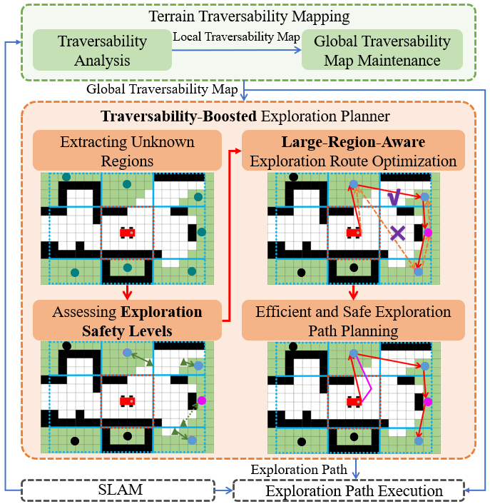
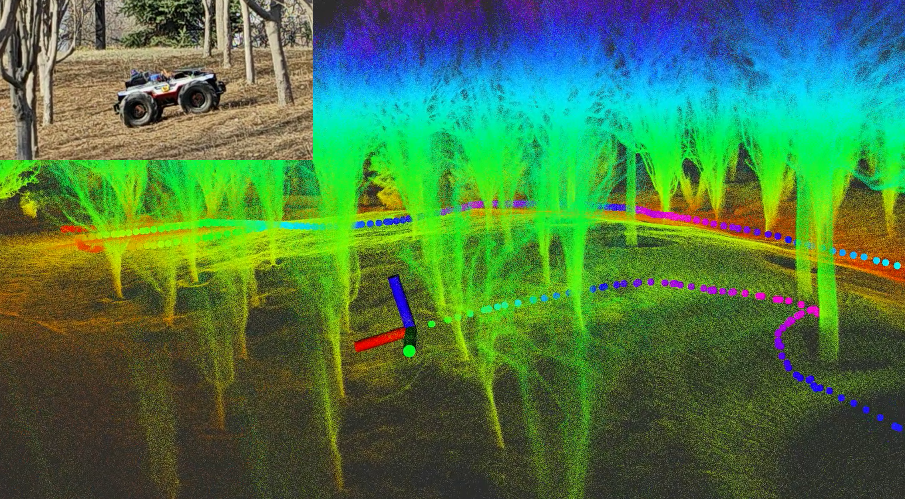
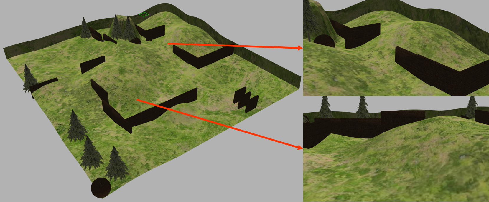
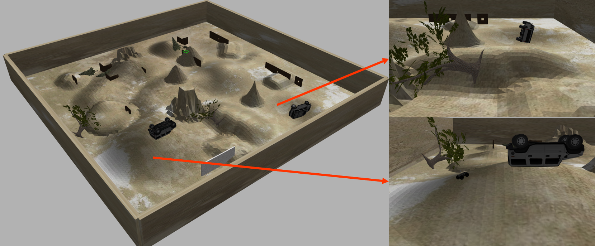
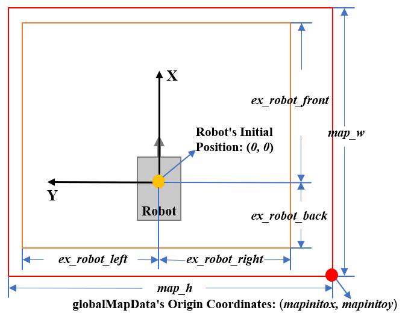

# LRAE ROS2

**LRAE** is a **L**arge-**R**egion-**A**ware **E**xploration method for safe and fast autonomous exploration on uneven terrain. This repository is a ROS2 Humble port of the original LRAE exploration stack, using Gazebo Classic simulation, a Scout V2 robot model, simulated Velodyne LiDAR, TF2, PCL, and `ament_cmake`/`colcon`.

LRAE improves exploration efficiency by prioritizing large unknown regions while still considering nearby small regions. It also introduces traversability information into unknown-region extraction and safety assessment, so the robot can plan exploration routes that are efficient and terrain-aware.

<p align="center">
  
  
</p>

**Video**: [YouTube](https://youtu.be/xePDPZluLes), [Bilibili](https://www.bilibili.com/video/BV1g1SVYWEfw/?spm_id_from=333.999.0.0&vd_source=0e7c59dd804a18d9a9c201eafe9ac6e5)

**Related paper**: [IEEE Xplore](https://ieeexplore.ieee.org/document/10734213)

Q. Bi, X. Zhang, S. Zhang, R. Wang, L. Li and J. Yuan, "LRAE: Large-Region-Aware Safe and Fast Autonomous Exploration of Ground Robots for Uneven Terrains," IEEE Robotics and Automation Letters, vol. 9, no. 12, pp. 11186-11193.

If this project is useful to your research, please cite the paper and star the code.

## Tested Environment

- Ubuntu 22.04
- ROS2 Humble
- Gazebo Classic with `gazebo_ros`
- `colcon` and `ament_cmake`
- x86_64 Linux and ARM Linux such as OrangePi RK3588

## Packages

- `fitplane`: traversability mapping, Gazebo world launch files, and RViz startup
- `sensor_conversion`: simulated SLAM output, odometry conversion, and point-cloud preprocessing
- `lrae_planner`: exploration planner and global map merge
- `local_planner`: local planner and path follower
- `gen_local_goal`: conversion from global exploration paths to local goals
- `simworld`: Gazebo worlds, models, and RViz configuration
- `scout_description`, `scout_gazebo_sim`: Scout robot model and Gazebo spawning

## Dependencies

Install ROS2 Humble and required simulation packages:

```bash
sudo apt update
sudo apt install \
  ros-humble-desktop \
  ros-humble-gazebo-ros-pkgs \
  ros-humble-gazebo-ros2-control \
  ros-humble-pcl-ros \
  ros-humble-pcl-conversions \
  ros-humble-tf2-ros \
  ros-humble-tf2-geometry-msgs \
  ros-humble-navigation2 \
  ros-humble-nav2-bringup \
  ros-humble-xacro \
  ros-humble-joint-state-publisher \
  ros-humble-joint-state-publisher-gui \
  ros-humble-robot-state-publisher \
  ros-humble-velodyne-description \
  ros-humble-velodyne-gazebo-plugins \
  python3-colcon-common-extensions
```

The Velodyne Gazebo plugin is required. Without it, `/velodyne_points` will have no Gazebo publisher and the exploration stack cannot build a map.

For Gazebo scenes, it is also useful to install or copy the following models into `~/.gazebo/models`:

- [gazebo_models](https://github.com/osrf/gazebo_models)
- [Supplementary Gazebo Models for LRAE](https://github.com/qingchen-bi/Supplementary-Gazebo-Models-for-LRAE)

## Build

Create a ROS2 workspace and clone this repository into `src`:

```bash
mkdir -p ~/LRAE_WS_Scout/src
cd ~/LRAE_WS_Scout/src
git clone https://github.com/Jacklenolee/LRAE_ROS2.git LRAE
cd ..
source /opt/ros/humble/setup.bash
colcon build --symlink-install
source install/setup.bash
```

If you changed CMake options or Eigen-related settings, rebuild the affected packages with a clean CMake cache:

```bash
source /opt/ros/humble/setup.bash
colcon build --packages-select lrae_planner fitplane local_planner sensor_conversion gen_local_goal --cmake-clean-cache
source install/setup.bash
```

## Run LRAE In Simulation

Open two terminals.

Terminal 1 starts Gazebo, Scout V2, simulated SLAM output, traversability mapping, and RViz:

```bash
cd ~/LRAE_WS_Scout
source /opt/ros/humble/setup.bash
source install/setup.bash
ros2 launch fitplane simulation_scene1.py
```

Terminal 2 starts exploration planning and local planning:

```bash
cd ~/LRAE_WS_Scout
source /opt/ros/humble/setup.bash
source install/setup.bash
ros2 launch lrae_planner exploration_scene1.py
```

After the system starts successfully, RViz should show the red route path, purple exploration path, green local path, traversability point cloud, and the robot moving through the scene.

## Run Different Scenes

The original project provides multiple simulation scenes with different terrain characteristics and sizes.

<p align="center">
  
  
</p>

Scene 1 has ROS2 Python launch files:

```bash
ros2 launch fitplane simulation_scene1.py
ros2 launch lrae_planner exploration_scene1.py
```

Scene 2 to Scene 4 use ROS2 XML launch files on the simulation side and matching planner launch files:

```bash
ros2 launch fitplane simulation_scene2.launch
ros2 launch lrae_planner exploration_scene2.py

ros2 launch fitplane simulation_scene3.launch
ros2 launch lrae_planner exploration_scene3.launch

ros2 launch fitplane simulation_scene4.launch
ros2 launch lrae_planner exploration_scene4.py
```

## Run LRAE In New Scenes

LRAE assumes a bounded exploration problem. Otherwise, exploration can continue indefinitely. When using a new scene, first define the exploration boundary around the robot, then set `globalMapData` so that the whole boundary is contained inside the global map.

Let the robot's initial position be the coordinate origin, the robot's heading be the positive x-axis, and the y-axis follow the right-hand coordinate system.

For the `Traversibility_mapping` node, configure:

```python
{'use_ex_range': True}
{'ex_robot_back': -10.0}
{'ex_robot_right': -10.0}
{'ex_robot_front': 50.0}
{'ex_robot_left': 50.0}
```

For the `exploration_map_merge` node, configure:

```python
{'map_w': 200}
{'map_h': 200}
{'mapinitox': -10.0}
{'mapinitoy': -10.0}
```

Parameter constraints:

1. Set `use_ex_range` to `true` when an exploration boundary is required.
2. `ex_robot_front` is the farthest exploration distance along positive x.
3. `ex_robot_back` is the farthest exploration distance along negative x.
4. `ex_robot_left` is the farthest exploration distance along positive y.
5. `ex_robot_right` is the farthest exploration distance along negative y.
6. `map_w >= ceil((ex_robot_front + abs(ex_robot_back)) / map_resolution)`.
7. `map_h >= ceil((ex_robot_left + abs(ex_robot_right)) / map_resolution)`.
8. The map resolution is set to `0.3` in this repository.
9. `mapinitox <= ex_robot_back`.
10. `mapinitoy <= ex_robot_right`.

In short, the exploration boundary defined by `Traversibility_mapping` must be fully contained in the `globalMapData` range defined by `exploration_map_merge`.

<p align="center">
  
</p>

## Main Parameters

Main parameters affecting terrain traversability analysis:

```cpp
float max_angle_ = 40.0;
float max_flatness_ = 0.01;
float w1_ = 0.8;
```

Main parameters affecting exploration performance:

```python
{'angle_pen': 0.45}
{'update_cen_thre': 6}
{'unknown_num_thre': 200}
{'minrange': 20.0}
{'limit_max_square': True}
{'use_go_end_nearest': True}
{'end_neacen_disthre': 10.0}
{'end_cur_disrate': 2.0}
```

Notes:

1. If the robot repeatedly explores tiny unknown regions, increase `unknown_num_thre` appropriately.
2. Because the Gazebo real-time factor is not always 1, use ROS time instead of wall-clock time to measure exploration time.
3. Exploration performance depends on traversability analysis and localization accuracy. If exploration is incomplete, first check whether the traversability map is correct, then tune traversability parameters for the scene. The algorithm is mainly designed for continuous rough terrain and has not been tested extensively on discrete terrain such as cliffs or steps.

## Expected Topics And TF

After `simulation_scene1.py` starts, verify the simulation side:

```bash
ros2 topic hz /velodyne_points
ros2 topic hz /base_pose_ground_truth
ros2 topic hz /laser_odom_init
ros2 topic hz /registered_point_cloud
ros2 run tf2_ros tf2_echo map base_link
```

Expected point-cloud and mapping chain:

```text
/velodyne_points
  -> slam_sim_output
  -> /transformed_cloud and /laser_odom_init
  -> map_generator_node
  -> /registered_point_cloud
  -> Traversibility_mapping
  -> /plane_OccMap and /local_traversibility_ponit_cloud
```

Expected TF chain:

```text
world -> map -> sensor -> base_link -> velodyne_base_link -> velodyne
```

## RViz Point Cloud Display

The default RViz config in `simworld/launch/demo.rviz` displays processed topics such as `/registered_point_cloud` and `/local_traversibility_ponit_cloud`. To check the raw Velodyne output directly:

1. Add a `PointCloud2` display.
2. Set Topic to `/velodyne_points`.
3. Set Fixed Frame to `map`. If it does not show, temporarily try `velodyne`.
4. Check `ros2 run tf2_ros tf2_echo map velodyne`.

If `/velodyne_points` has data but `/registered_point_cloud` has no publisher, the Velodyne plugin is working but the conversion or mapping chain is broken.

## Troubleshooting

### `map` And `base_link` Are Not Connected

Example:

```text
Could not find a connection between 'map' and 'base_link' because they are not part of the same tree.
```

Check:

```bash
ros2 node list --no-daemon
ros2 topic hz /velodyne_points
ros2 topic hz /laser_odom_init
ros2 topic info /tf -v --no-daemon
ros2 run tf2_ros tf2_echo map base_link
```

Fixes:

- Start `fitplane simulation_scene1.py` before `lrae_planner exploration_scene1.py`.
- Make sure `/velodyne_points` and `/base_pose_ground_truth` both publish data.
- Make sure `slam_sim_output` is running.
- Make sure the `sensor_baselink` static transform is running.

### `/velodyne_points` Has No Publisher

Check:

```bash
ros2 topic info /velodyne_points -v --no-daemon
```

If publisher count is `0`, install the Velodyne Gazebo plugin:

```bash
sudo apt update
sudo apt install ros-humble-velodyne-gazebo-plugins
```

Then restart Gazebo and verify:

```bash
ros2 pkg prefix velodyne_gazebo_plugins
ros2 topic hz /velodyne_points
```

### Velodyne Plugin Ready But RViz Shows No Point Cloud

If the log contains `Velodyne laser plugin ready` but RViz shows nothing, check whether RViz is displaying the raw or processed topic:

```bash
ros2 topic hz /velodyne_points
ros2 topic info /registered_point_cloud -v --no-daemon
ros2 topic hz /registered_point_cloud
```

If `/velodyne_points` works but `/registered_point_cloud` has no publisher, check `map_generator_node` and `slam_sim_output_node`.

### `map_generator_node` Crashes With `exit code -11` Or `malloc.c` Assertion

Invalid or inconsistent point-cloud metadata can crash PCL conversion and filtering. This ROS2 port fixes generated point-cloud metadata in `sensor_conversion/src/slam_output.cpp` and adds guards in `sensor_conversion/src/map_generator_node.cpp`.

Rebuild:

```bash
source /opt/ros/humble/setup.bash
colcon build --packages-select sensor_conversion --cmake-clean-cache
source install/setup.bash
```

Then fully stop and restart the launch file so the new binary is used.

### `spawn_entity.py` Times Out But Gazebo Later Loads Plugins

Example:

```text
Entity pushed to spawn queue, but spawn service timed out waiting for entity to appear
```

If Gazebo later prints `Velodyne laser plugin ready` and `diff_drive: Subscribed to [/cmd_vel]`, the entity was likely inserted slowly and the Python spawner returned too early. This port increases the `spawn_entity.py` timeout in `scout_v2_empty_world.launch.py`.

If the entity already exists from a previous run, fully stop Gazebo before restarting:

```bash
pkill -f gzserver
pkill -f gzclient
```

Use these commands only when you intentionally want to stop the current simulation.

### ARM / OrangePi RK3588 Eigen SVD Or Angle Error

On some ARM boards, Eigen vectorization or alignment can cause large numeric deviations or alignment problems in SVD-related code. This project adds the following compile definitions to Eigen/PCL-related packages:

```cmake
EIGEN_DONT_VECTORIZE
EIGEN_DISABLE_UNALIGNED_ARRAY_ASSERT
```

They are added in:

- `lrae_planner`
- `fitplane`
- `local_planner`
- `sensor_conversion`
- `gen_local_goal`

Rebuild after changing them:

```bash
source /opt/ros/humble/setup.bash
colcon build --packages-select lrae_planner fitplane local_planner sensor_conversion gen_local_goal --cmake-clean-cache
source install/setup.bash
```

These macros disable Eigen SIMD vectorization and unaligned array assertions. They do not by themselves change all math to `double`; code that requires double precision should still use `Eigen::MatrixXd`, `Eigen::Vector3d`, and `double`.

### Gazebo `libcurl: Failed to connect to 127.0.0.1 port 7897`

This usually comes from a proxy environment variable used by Gazebo model downloads or GUI resources. It is not the main cause of missing local Velodyne points if the Velodyne plugin is already ready.

If needed, unset proxy variables before launching:

```bash
unset http_proxy https_proxy HTTP_PROXY HTTPS_PROXY ALL_PROXY all_proxy
```

## Useful Debug Commands

```bash
ros2 node list --no-daemon
ros2 topic list --no-daemon
ros2 topic info /tf -v --no-daemon
ros2 topic info /tf_static -v --no-daemon
ros2 run tf2_tools view_frames
ros2 run tf2_ros tf2_echo map base_link
ros2 run tf2_ros tf2_echo map velodyne
```

## Citation

If you use this project in your research, please cite:

```bibtex
@article{bi2024lrae,
  author={Bi, Q. and Zhang, X. and Zhang, S. and Wang, R. and Li, L. and Yuan, J.},
  journal={IEEE Robotics and Automation Letters},
  title={LRAE: Large-Region-Aware Safe and Fast Autonomous Exploration of Ground Robots for Uneven Terrains},
  year={2024},
  volume={9},
  number={12},
  pages={11186-11193}
}
```

## Acknowledgements

We sincerely appreciate the following open-source projects: [FAEL](https://github.com/SYSU-RoboticsLab/FAEL), [TARE](https://github.com/caochao39/tare_planner), [PUTN](https://github.com/jianzhuozhuTHU/putn), Ji Zhang's [local_planner](https://github.com/jizhang-cmu/ground_based_autonomy_basic/tree/noetic/src/local_planner), Scout simulation, Gazebo, Velodyne simulation, PCL, TF2, and ROS2 Navigation-related tooling.
